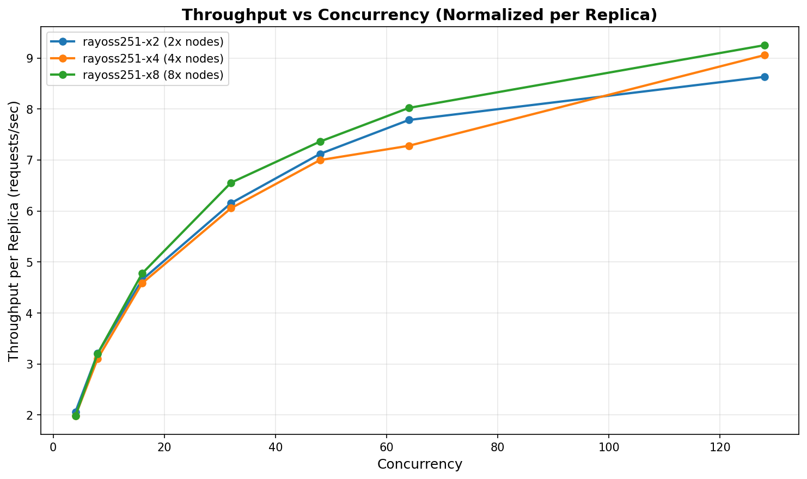
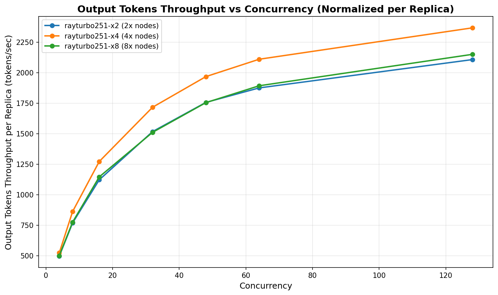

# Horizontal scaling benchmarks

This benchmark demonstrates that Ray Serve scales horizontally with linear throughput gains. When you scale the number of replicas in a deployment from 1x → 2x → 4x, you'll see proportional increases in aggregate throughput.

## Contents

- [Overview](#overview)
  - [Key benchmark considerations](#key-benchmark-considerations)
  - [Runtime comparison](#runtime-comparison)
  - [Setup](#setup)
- [Quick start](#quick-start)
  - [Prerequisites](#prerequisites)
  - [Configuration](#configuration)
  - [Basic usage](#basic-usage)
  - [Advanced usage](#advanced-usage)
- [Results structure](#results-structure)
- [Environment variables](#environment-variables)
- [Benchmark results](#benchmark-results)

## Overview

### Key benchmark considerations

To accurately measure horizontal scaling, you must account for several factors:

- **Client scaling**: The client must scale proportionally with the server to prevent becoming a bottleneck at high concurrencies as serving capacity increases.
- **Symmetric component scaling**: All server-side components must scale at the same rate to avoid asymmetry that creates bottlenecks. The ingress deployment should scale with the LLM deployment.
- **Disable prefix caching**: The engine's prefix caching capability can confound results. When prefix caching is enabled, request content and cache hit patterns can impact results in non-intuitive ways, even with randomly generated requests if the seed is shared across runs. These benchmarks pass `enable_prefix_caching=False` to the engine kwargs.

### Runtime comparison

This benchmark compares Ray Serve with open-source Ray against Anyscale runtime optimizations to evaluate horizontal scaling characteristics for LLMs. You can build two sets of Anyscale images with different configurations (If you are using Kuberay you can use the open source ray images to do the same thing):

**rayoss-251 image** (optimizations disabled):

```dockerfile
FROM anyscale/ray-llm:2.51.0-py311-cu128

ENV ANYSCALE_DISABLE_OPTIMIZED_RAY=1
ENV RAY_SERVE_THROUGHPUT_OPTIMIZED=1
```

**rayturbo-251 image** (optimizations enabled):

```dockerfile
FROM anyscale/ray-llm:2.51.0-py311-cu128

ENV ANYSCALE_RAY_SERVE_ENABLE_HA_PROXY=1
ENV RAY_SERVE_THROUGHPUT_OPTIMIZED=1
ENV ANYSCALE_RAY_SERVE_DIRECT_INGRESS_MIN_DRAINING_PERIOD_S=90
```

The repository includes service YAML configurations in `oss_configs/` and `turbo_configs/` directories. Deploy each configuration as an Anyscale service:

```bash
anyscale services deploy -f <config.yaml>
```

After deployment, configure the URL and API key as environment variables for testing.

### Setup

- **Ray**: 2.51.0
- **vLLM**: 0.11.0
- **GPU nodes**: 8x NVIDIA H100 GPUs per node


## Quick start

### Prerequisites

Install `just`, a command runner that simplifies benchmark execution:

```bash
# Install using the official install script (recommended)
curl --proto '=https' --tlsv1.2 -sSf https://just.systems/install.sh | sudo bash -s -- --to /usr/local/bin

# Verify installation
just --version
```

Alternatively, you can download the pre-built binary manually:

```bash
wget https://github.com/casey/just/releases/latest/download/just-x86_64-unknown-linux-musl.tar.gz
tar -xzf just-*.tar.gz
sudo mv just /usr/local/bin/
```

### Configuration

Configure environment variables for your API endpoint:

```bash
# Required: Set the API URL
export OPENAI_API_URL="http://127.0.0.1:8000"

# Optional: Set API key if authentication is required
export OPENAI_API_KEY="your-api-key-here"
```

### Basic usage

The following examples show common benchmark operations:

```bash
# Set API URL (defaults to http://127.0.0.1:8000 if not set)
export OPENAI_API_URL="http://your-server:8000"

# Run a benchmark with default settings (1 client, all concurrency values)
just bench my-experiment

# Run with 8 parallel clients
just bench my-experiment 8

# Run with custom concurrency values and 8 parallel clients
just bench-conc my-experiment 8 "4,8,16,32"

# Run smoke test to verify server connectivity
just smoke

# List all experiment results
just results

# Show results and plot for a specific experiment (must use full path)
just results bm_results/my-experiment

# Plot multiple experiments matching a pattern (shell expands glob)
just results bm_results/rayoss251-x* output.png

# Clean up zombie processes
just clean
```

### Advanced usage

For advanced options such as request-rate, custom token lengths, or other parameters, use `run_bm.sh` directly:

```bash
./run_bm.sh -e my-experiment -t request-rate -r "1,2,4" -s 4 && \
python3 aggregate_results.py my-experiment
```

Run `./run_bm.sh --help` to see all available options, including:

- `--itl`, `--otl` - Custom input/output token lengths
- `-u` - Custom base URL (overrides `OPENAI_API_URL` environment variable)
- `-t request-rate` - Request-rate benchmarking mode

## Results structure

The benchmark stores results in the following directory structure:

- `bm_results/EXP_NAME/part1/`, `part2/`, etc. - Individual run results from each parallel client
- `bm_results/EXP_NAME/all-parts/` - Aggregated results combining all runs (sum of throughputs, average of latencies)

## Environment variables

The benchmark uses the following environment variables:

- `OPENAI_API_URL` - Base URL for the API endpoint (default: `http://127.0.0.1:8000`)
- `OPENAI_API_KEY` - API key for authentication (optional, can be empty)

You can set these variables in your shell or pass them inline:

```bash
OPENAI_API_URL="http://your-server:8000" just bench my-experiment 8
```

## Benchmark results

To generate plots from your benchmark results:

```bash
just results bm_results/*oss* plots/oss.png
just results bm_results/*turbo* plots/turbo.png
```

### Analysis

The following plots compare horizontal scaling characteristics between Ray Serve with open-source Ray (left) and Anyscale runtime optimizations (right):

<table>
  <tr>
    <td></td>
    <td></td>
  </tr>
  <tr>
    <td align="center"><b>Ray open-source (OSS)</b></td>
    <td align="center"><b>Anyscale runtime</b></td>
  </tr>
</table>

These plots demonstrate that throughput per replica remains nearly constant across all concurrency levels and doesn't degrade due to horizontal scaling. This indicates approximately linear scaling even at high concurrencies for both Anyscale runtime and Ray open-source. There is not much difference on this experiment, for this workload and at these concurrency levels. 

