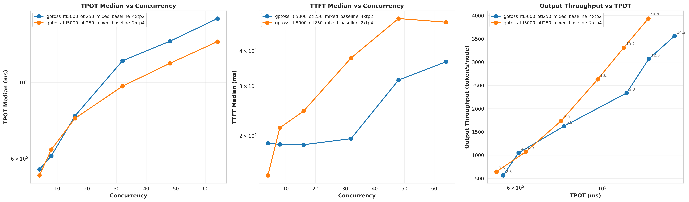

# Experiments and Findings

Three experiments that tell the PD disaggregation story with reproducible scripts and observations.

## Quick Start

1. **Setup**: Follow [../docs/SETUP.md](../docs/SETUP.md) to configure hardware and NIXL+UCX
2. **Run experiments**: Execute the three scripts in order
3. **Visualize**: `python ../viz.py --exps <experiment_dirs>`

## The Three Experiments on 2xP5.48xlarge with EFA

### 1. TP Baselines - Understanding TTFT vs TPOT Trade-offs

**Script**: `bash tp-baselines.sh`

**Purpose**: Establish collocated baselines to understand conflicting optimization needs.

**What it runs**:
- TP=2 (4 replicas)  
- TP=4 (2 replicas)

**Key observations**:
- **TPOT (decode)**: TP4 better than TP2 (higher TP improves decode especially at higher concurrency)
- **TTFT (prefill)**: TP2 better at low concurrency, TP4 at high concurrency
- **Overall efficiency**: TP4 > TP2 (workload is decode-dominated)

**Takeaway**: There's a fundamental trade-off between optimizing for prefill (TTFT) and decode (TPOT). One of the reasons to do PD as we can independently optimize P and D.

---

### 2. PD Ratio Exploration - Configuration Choices Matter

**Script**: `bash pd-ratio-sweep.sh`

**Purpose**: Explore how P:D ratios and TP combinations affect performance.

**What it runs**:

**Part 1: D:TP4 (highest decode performance)**
- 1P-TP4 : 1D-TP4 (symmetric)
- 1P-TP2 : 1D-TP4, 2P-TP2 : 1D-TP4 (asymmetric)

**Part 2: D:TP2 ratio exploration**
- P:TP2, D:TP2 with ratios: 3:1, 2:1, 1:1, 1:2, 1:3

**Key observations**:

1. **P:D ratio matters more than ITL:OTL ratio**
   - Despite ITL:OTL = 5000:250 (20:1), decode-heavy ratios (1:2, 1:3) outperformed prefill-heavy (2:1, 3:1)
   - Prefill-heavy ratios were dominated by collocated baseline

2. **Optimal ratio shifts with throughput regime**
   - Low throughput/latency: 1:3 optimal
   - Mid throughput (50-65k tokens/s): 1:2 optimal
   - High throughput (65-70k tokens/s): 1:1 optimal

3. **TP4-TP4 can beat collocated in efficiency**
   - 1P-TP4 : 1D-TP4 beats the collocated variation

**Takeaways**:
- Need dynamic ratio adjustment for different SLAs
- Must sweep configurations empirically for your workload

*Figure: PD ratio exploration with D:TP4 configurations*

*Figure: PD ratio exploration with D:TP2 configurations*

---

### 3. Network Impact - Inter node vs. Intra node communication

**Script**: `bash pack-vs-spread.sh`

**Purpose**: Demonstrate how network configuration affects multi-node PD.

**What it runs**:
- Pack mode (same node, CUDA IPC)
- Spread with SRD (cross-node, good network)
- Spread with TCP (cross-node, emulates bad transport layer fallback)

All use 1P-TP4 : 1D-TP4 configuration.

**Key observations**:

1. **With good network (SRD): Pack ≈ Spread**
   - Proper UCX with SRD backend on EFA
   - Cross-node bandwidth: 10-12 GB/s
   - Performance comparable to single-node

2. **With bad network (TCP): Spread << Pack**
   - Forced TCP transport: ~100x slower
   - Shows critical importance of network config

**Takeaway**: PD disaggregation works well across nodes with proper network setup (UCX+EFA), making it practical for large-scale deployments.

*Figure: Pack vs Spread modes with different network configurations*

## Results from 2x 8xH200 nodes with IB
We also benchmarked the same setup on infinyband setup to see the difference.

*Figure: Pack vs Spread modes on IB 2x8xH200s*

We can see we have a good installation of NIXL + UCX on this setup as well. The difference between inter and intra node should be minimal for kv-cache transfer. If this is not the case, the network layer is not configured properly. 

